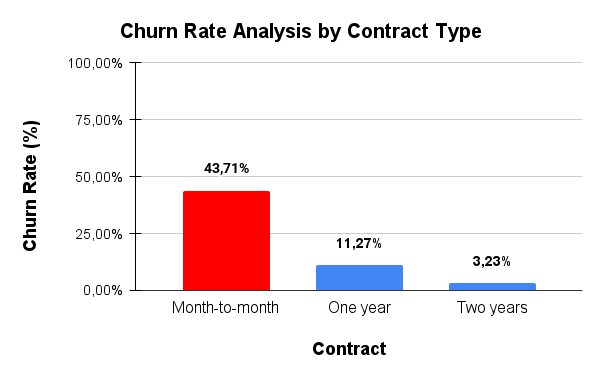
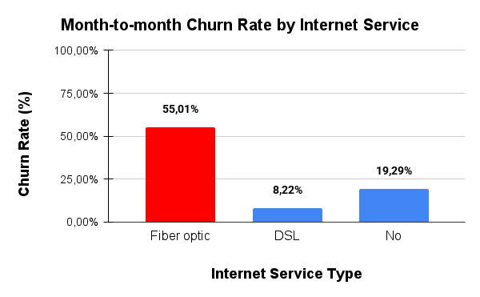
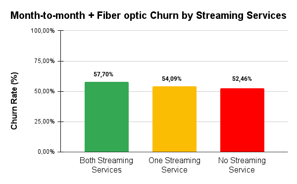
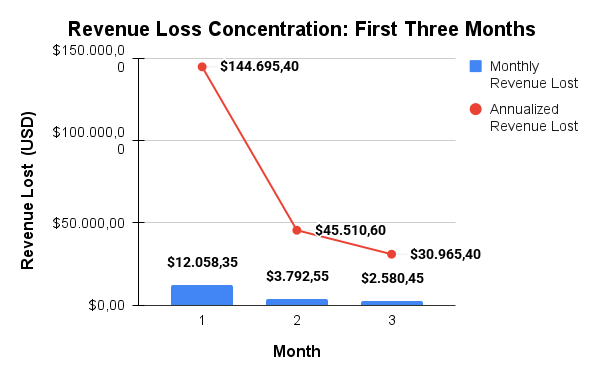

# Telco Customer Churn Analysis

## 🎯 About This Project
I analyzed customer data from a telecom company to understand why customers leave and how to reduce churn.

## What I Discovered

### 🚨 The Biggest Problem
I found a specific group of customers who leave at an incredibly high rate:
- Month-to-month contracts with Fiber internet
- No TechSupport 
- No security services
- First 3 months as customers

**Churn Rate by Contract Type**

*Month-to-month contracts have 4x higher churn than annual contracts - this is where we need to focus*

### 🔍 Digging Deeper: The Fiber Optic Crisis
While month-to-month contracts are problematic overall, Fiber optic customers drive the majority of churn in this segment.

**Month-to-month Churn by Internet Service**

*Fiber optic customers churn at 54% vs 30% for DSL - revealing our most vulnerable segment*

### 🛠️ What Actually Helps Keep Customers
Not all services are created equal when it comes to retention. Some have dramatic impact, while others show minimal effect.

**🔧 Tech Support Impact**

*Tech Support cuts churn by more than half - from 55% to 22% for at-risk customers*

**🛡️ Security Services Impact**

*Security services reduce churn by 64% - full security packages drop churn to just 32%*

**🎬 Streaming Services Impact**

*Streaming services don't significantly affect customer retention - focusing here won't solve our churn problem*

### Combined Risk Factors
The most dangerous scenario occurs when multiple risk factors combine.

**⚡ Combined Impact: Security + Tech Support**

*Customers with no Tech Support AND no security services experience catastrophic 81% churn rates*

### ⏰ When the Damage Happens
Timing is critical - most churn occurs rapidly in the early stages.

**📅 Churn Timeline**

*High-risk customers churn rapidly within the first three months, with the highest attrition in month one*

### 💰 The Financial Impact
**📉 Revenue Loss Concentration**

*The first three months see the highest concentration of churn, with month one contributing over $140,000 to the total $221,000 annual revenue at risk.*

**The numbers:**
- 81% of these customers leave within 3 months
- 295 customers in this risky group
- $221,000+ yearly revenue at risk
- $140,000+ lost in the first month alone

## My Recommendations

### ✅ Fix the Immediate Problem
Create a "Fiber Care Package" that includes:
- TechSupport (most important)
- Basic security services
- Priced around $80-85/month

### ⏰ When to Intervene
Focus on new customers in their first 90 days:
- Offer free TechSupport for the first month
- Check in with at-risk customers
- Make key services mandatory for risky segments

## How I Did This Analysis

### 📊 SQL Skills I Used
- Complex queries with multiple conditions
- Customer segmentation
- Revenue impact calculations
- Time-based analysis (when customers leave)

### The Process
1. Started with basic churn rates
2. Identified which customer types churn most
3. Tested different services to see what actually helps retention
4. Calculated the financial impact
5. Built practical recommendations

## Benefits for the Company
Before this analysis, the company knew they had a churn problem but didn't know where to focus. Now they have:
- A clear profile of at-risk customers
- Specific services that actually reduce churn
- A realistic plan that could save $136,000+ per year

---

*Analysis conducted using SQLite on a complete dataset of 7,044 telecom customers.*
*All insights based on statistical analysis of customer behavior patterns.*
